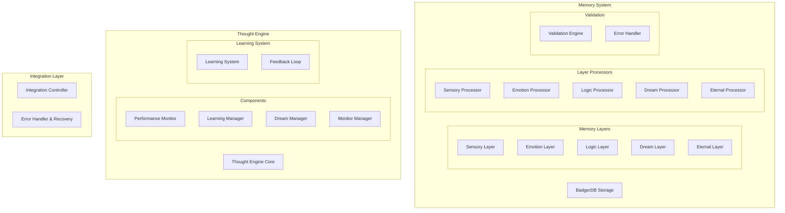

# Enhanced Memory and Thought Engine Architecture

## Overview

This document outlines the enhanced architecture for the memory and thought engine system, focusing on improved performance, reliability, and scalability.

## System Architecture

## Memory System Architecture

### Storage Layer (BadgerDB)
- Optimized key-value storage
- Efficient data compression
- Concurrent access handling
- Transaction management
- Data integrity verification

### Cross-Layer Interaction
- Bidirectional data flow
- Event-driven propagation
- Priority-based processing
- State synchronization
- Conflict resolution

### Specialized Processors
- Enhanced pattern recognition
- Real-time data transformation
- Contextual processing
- Adaptive filtering
- Resource optimization

### Validation Framework
- Schema validation
- Data consistency checks
- Type safety enforcement
- Constraint validation
- Error classification

### Performance Optimization
- Caching strategy
- Index optimization
- Batch processing
- Resource pooling
- Load balancing

## Thought Engine Architecture

### Core Components
- Enhanced pattern detection
- Improved learning algorithms
- Optimized dream processing
- Real-time monitoring
- State management

### Learning System
- Adaptive learning rates
- Pattern reinforcement
- Knowledge consolidation
- Experience replay
- Model optimization

### Memory Integration
- Seamless data flow
- Context preservation
- State synchronization
- Priority handling
- Resource sharing

### Dream Processing
- Pattern synthesis
- Memory consolidation
- Insight generation
- Knowledge integration
- Experience optimization

### Feedback Mechanisms
- Real-time adaptation
- Performance metrics
- Learning optimization
- Error correction
- System improvement

## Integration Architecture

### Communication Patterns
- Event-driven architecture
- Message queuing
- State synchronization
- Priority handling
- Error propagation

### Optimization Strategies
- Resource sharing
- Load balancing
- Cache optimization
- Batch processing
- Connection pooling

### Performance Monitoring
- Real-time metrics
- Resource utilization
- System health checks
- Bottleneck detection
- Performance alerts

### Error Handling
- Graceful degradation
- Automatic recovery
- Error classification
- State preservation
- System restoration

## Testing Architecture

### Benchmark Framework
- Performance metrics
- Load testing
- Resource monitoring
- Comparative analysis
- Optimization validation

### Stress Testing
- Load simulation
- Resource limits
- Error conditions
- Recovery testing
- Performance boundaries

### Edge Cases
- Error conditions
- Boundary testing
- State transitions
- Resource constraints
- System limits

### Integration Testing
- Component interaction
- State management
- Data flow validation
- Error handling
- Performance impact

## Migration Plan

1. Phase 1: Storage Layer
   - Implement BadgerDB optimizations
   - Update data structures
   - Migrate existing data
   - Validate performance

2. Phase 2: Processors
   - Deploy enhanced processors
   - Update interaction patterns
   - Implement validation
   - Optimize performance

3. Phase 3: Thought Engine
   - Update core components
   - Implement learning system
   - Deploy dream processing
   - Enable feedback loops

4. Phase 4: Integration
   - Implement communication patterns
   - Deploy monitoring system
   - Enable error handling
   - Optimize performance

5. Phase 5: Testing
   - Deploy benchmark framework
   - Implement stress tests
   - Validate edge cases
   - Enable integration tests