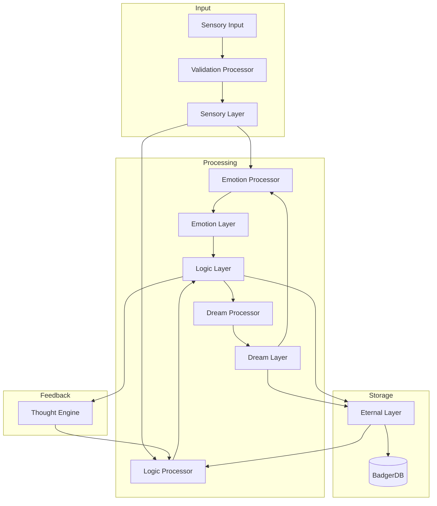
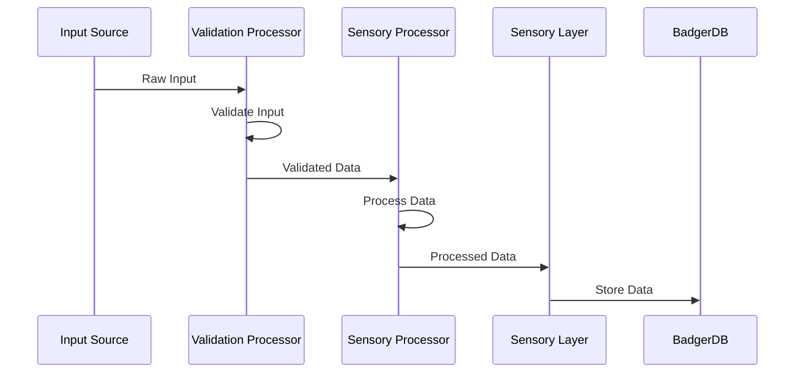
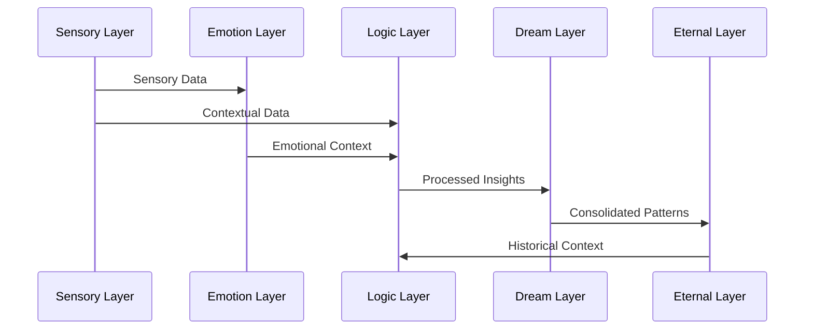
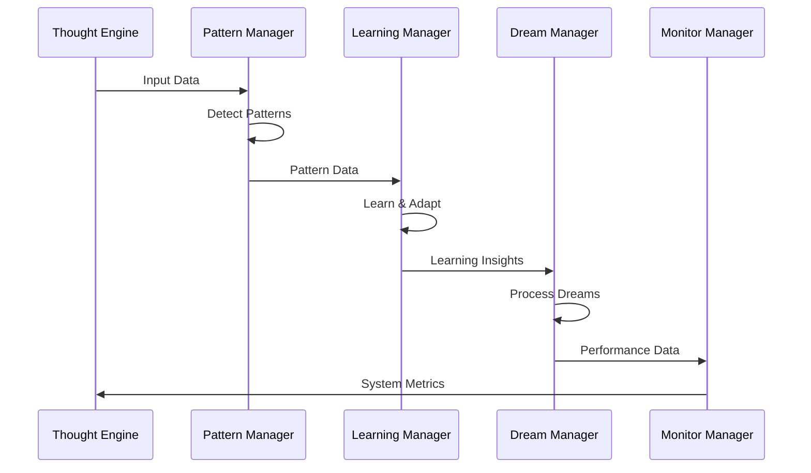
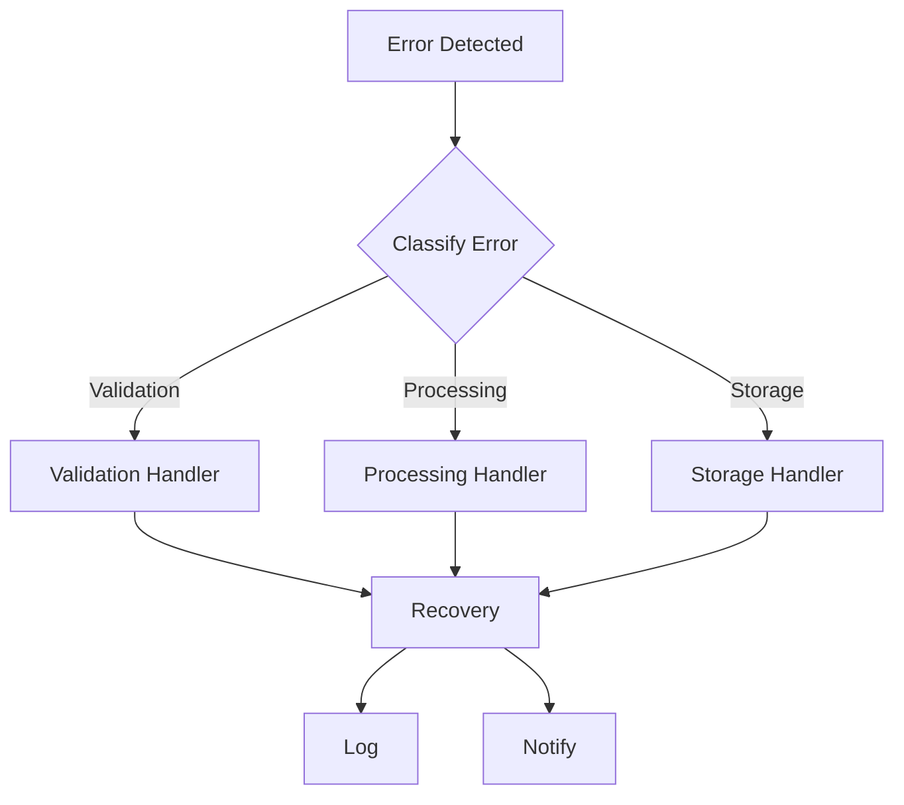
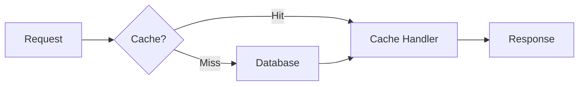
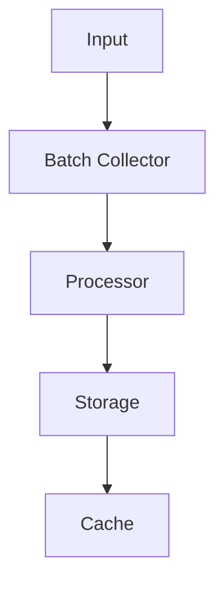

# Data Flow Patterns

## Overview

This document details the data flow patterns in the enhanced memory and thought engine system, describing how information moves between components and layers.

## Core Data Flow Patterns

## Detailed Flow Descriptions

### 1. Input Processing Flow

### 2. Memory Layer Interaction Flow

### 3. Thought Processing Flow

## Data Transformation Rules

### 1. Validation Rules
- All input data must pass schema validation
- Type checking is enforced at each layer
- Data integrity is verified before processing
- Validation errors trigger immediate feedback

### 2. Processing Rules
- Each layer applies specific transformations
- Data enrichment occurs at each step
- Context is preserved across transformations
- Processing errors are handled gracefully

### 3. Storage Rules
- Data is versioned in BadgerDB
- Compression is applied based on data type
- Indexes are maintained for quick retrieval
- Storage operations are transactional

## Cross-Component Communication

### 1. Event-Based Communication

### 2. Direct Communication

## Error Handling Flow

## Performance Optimization Points

### 1. Caching Strategy

### 2. Batch Processing

## System States

### 1. Normal Operation
- Sequential data flow through layers
- Regular pattern detection and learning
- Continuous monitoring and optimization

### 2. High Load
- Batch processing activated
- Caching heavily utilized
- Non-critical operations deferred

### 3. Recovery
- Error handling active
- State restoration in progress
- Gradual service restoration

## Data Retention Policies

### 1. Short-term Storage
- Sensory data: 24 hours
- Emotional context: 72 hours
- Processing results: 1 week

### 2. Long-term Storage
- Pattern data: 6 months
- Learning outcomes: 1 year
- Critical insights: Permanent

## Monitoring Points

### 1. Performance Metrics
- Processing latency
- Storage utilization
- Cache hit rates
- Queue lengths

### 2. Health Metrics
- Error rates
- Recovery times
- System load
- Resource usage

These data flow patterns ensure efficient, reliable, and scalable operation of the enhanced memory and thought engine system while maintaining data integrity and system performance.