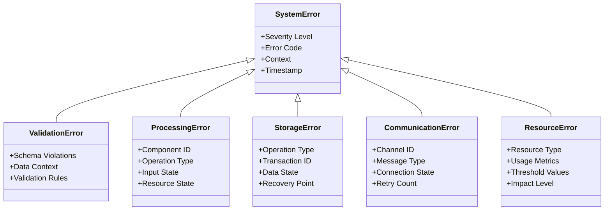
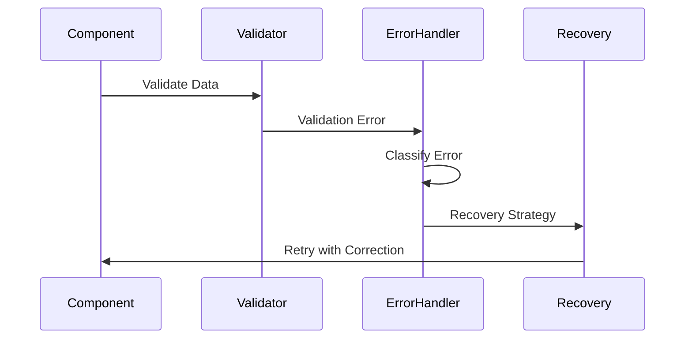
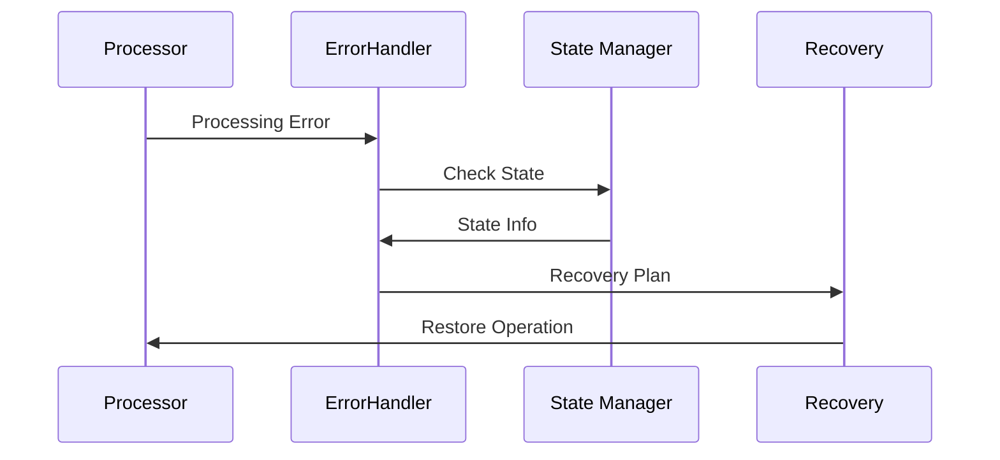
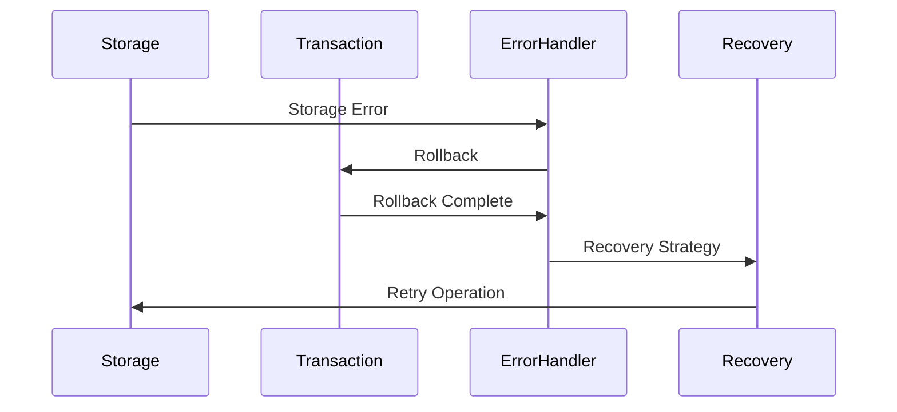

# Error Handling Strategies

## Overview

This document details the comprehensive error handling strategies implemented across the enhanced memory and thought engine system. The approach focuses on resilience, recovery, and maintaining system stability.

## Error Classification

### 1. Error Categories



## Error Handling Layers

### 1. Component-Level Handling

```go
// Error handling at individual component level
type ComponentError struct {
    Code        string
    Message     string
    Component   string
    Recoverable bool
    Context     map[string]interface{}
}

func (e *ComponentError) Handle() RecoveryAction {
    switch e.Code {
    case "validation":
        return ValidateAndRetry
    case "processing":
        return RestartComponent
    case "resource":
        return ReallocateResources
    default:
        return EscalateError
    }
}
```

### 2. System-Level Handling

```go
// System-wide error handling
type SystemErrorHandler struct {
    ErrorQueue     chan ComponentError
    RecoveryQueue  chan RecoveryAction
    StateManager   *StateManager
    MetricsCollector *MetricsCollector
}

func (h *SystemErrorHandler) HandleError(err ComponentError) {
    // 1. Log error
    // 2. Update metrics
    // 3. Determine recovery strategy
    // 4. Execute recovery
    // 5. Verify system state
}
```

## Recovery Strategies

### 1. Immediate Recovery
- Automatic retry with exponential backoff
- State rollback to last known good state
- Resource reallocation
- Component restart

### 2. Graceful Degradation
- Fallback to simplified processing
- Reduced functionality mode
- Cache-only operations
- Temporary request queuing

### 3. System Protection
- Circuit breaker implementation
- Resource isolation
- Load shedding
- Request throttling

## Error Handling Workflows

### 1. Validation Error Workflow



### 2. Processing Error Workflow



### 3. Storage Error Workflow



## Error Prevention Strategies

### 1. Input Validation
- Schema validation
- Type checking
- Range validation
- Format verification

### 2. State Validation
- Consistency checks
- Integrity verification
- State transition validation
- Resource availability checks

### 3. Resource Management
- Resource pooling
- Connection management
- Memory monitoring
- Load balancing

## Monitoring and Alerting

### 1. Error Metrics
```go
type ErrorMetrics struct {
    ErrorCount     int
    ErrorRate      float64
    RecoveryRate   float64
    FailureImpact  float64
    MTTR          float64  // Mean Time To Recovery
}
```

### 2. Alert Thresholds
```go
type AlertThresholds struct {
    ErrorRateThreshold     float64
    RecoveryTimeThreshold  float64
    FailureImpactThreshold float64
    ResourceUsageThreshold float64
}
```

## Recovery Testing

### 1. Chaos Testing
- Random component failures
- Network partitions
- Resource exhaustion
- State corruption

### 2. Recovery Validation
- State verification
- Performance impact
- Data consistency
- Service availability

## Best Practices

### 1. Error Design
- Use structured error types
- Include context information
- Enable error aggregation
- Support error classification

### 2. Recovery Design
- Implement idempotent operations
- Use transaction boundaries
- Maintain audit trails
- Enable partial recovery

### 3. Monitoring Design
- Real-time error tracking
- Recovery metrics collection
- Performance impact analysis
- Resource usage monitoring

## Implementation Guidelines

### 1. Error Handling
```go
func handleError(err error) RecoveryAction {
    // 1. Classify error
    errorType := classifyError(err)
    
    // 2. Log error with context
    logErrorWithContext(err, getErrorContext())
    
    // 3. Update metrics
    updateErrorMetrics(errorType)
    
    // 4. Determine recovery strategy
    strategy := determineRecoveryStrategy(errorType)
    
    // 5. Execute recovery
    return executeRecovery(strategy)
}
```

### 2. Recovery Implementation
```go
func executeRecovery(strategy RecoveryStrategy) error {
    // 1. Prepare recovery
    prepareRecovery()
    
    // 2. Execute recovery steps
    err := strategy.Execute()
    
    // 3. Verify recovery
    if err == nil {
        verifyRecovery()
    }
    
    // 4. Update metrics
    updateRecoveryMetrics()
    
    return err
}
```

This comprehensive error handling strategy ensures system resilience while maintaining data integrity and system stability. The multi-layered approach allows for graceful degradation and efficient recovery from various types of failures.