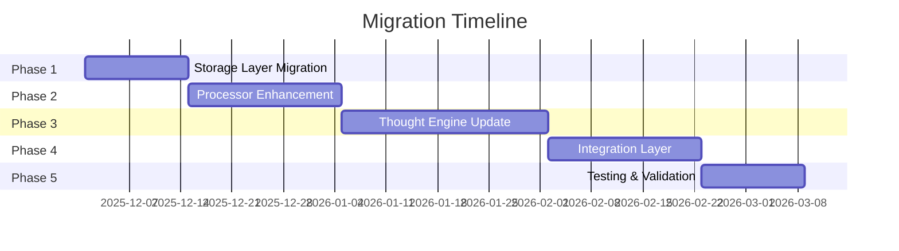
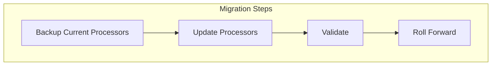
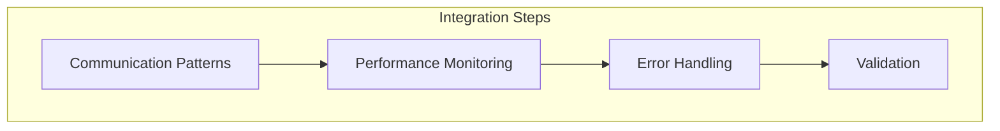
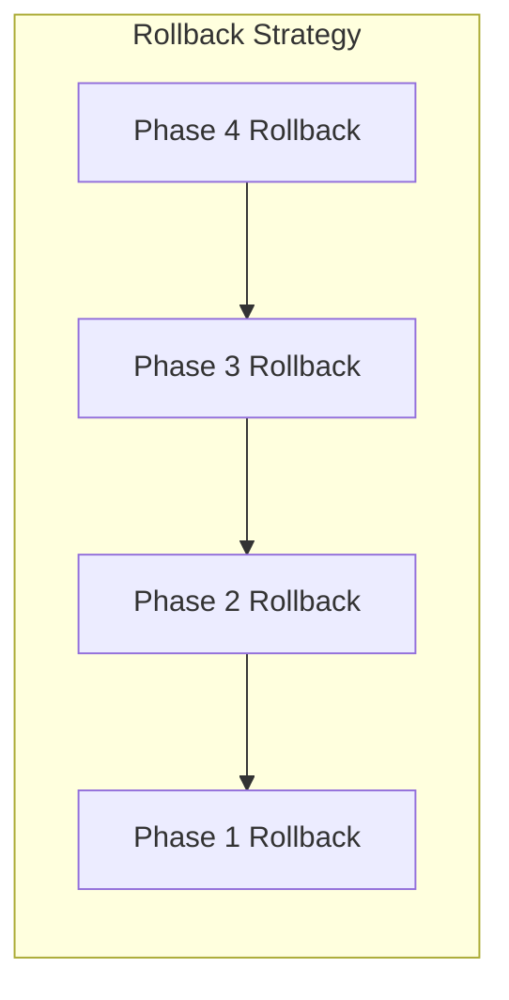
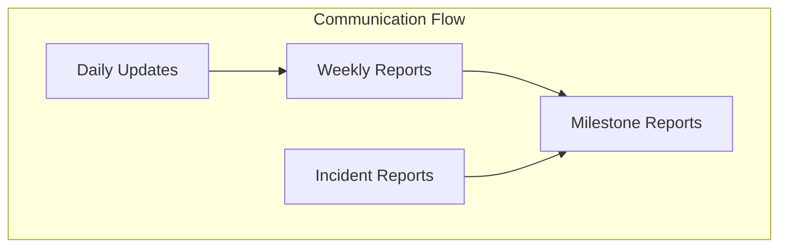

# Migration Plan

## Overview

This document outlines the step-by-step migration plan from the current implementation to the enhanced memory and thought engine architecture. The migration is designed to be incremental and minimize system disruption.

## Migration Phases



## Phase 1: Storage Layer Migration

### 1. BadgerDB Optimization
```go
// Migration steps for storage layer
type StorageMigration struct {
    // Pre-migration tasks
    BackupCurrentData()
    ValidateBackup()
    
    // Migration tasks
    UpdateBadgerConfig()
    MigrateData()
    ValidateMigration()
    
    // Rollback plan
    PrepareRollbackPoint()
    RollbackIfNeeded()
}
```

### Timeline: 2 weeks
1. Week 1:
   - Create data backup
   - Deploy new BadgerDB configuration
   - Begin incremental data migration
   - Monitor system performance

2. Week 2:
   - Complete data migration
   - Validate data integrity
   - Performance testing
   - Rollback preparation

## Phase 2: Processor Enhancement

### 1. Layer Processor Updates


### Timeline: 3 weeks
1. Week 1:
   - Deploy new processor interfaces
   - Implement enhanced validation
   - Begin processor migration

2. Week 2:
   - Complete processor migration
   - Update interaction patterns
   - Initial testing

3. Week 3:
   - Performance optimization
   - System validation
   - Rollback verification

## Phase 3: Thought Engine Update

### 1. Component Migration
```go
type ThoughtEngineMigration struct {
    // Core components
    MigratePatternManager()
    MigrateLearningSystem()
    MigrateDreamProcessor()
    
    // Integration
    UpdateMemoryIntegration()
    UpdateFeedbackLoops()
    
    // Validation
    ValidateComponents()
    TestIntegration()
}
```

### Timeline: 4 weeks
1. Week 1:
   - Core component preparation
   - Interface implementation
   - Initial deployment

2. Week 2:
   - Pattern system migration
   - Learning system update
   - Integration testing

3. Week 3:
   - Dream processing migration
   - Feedback loop implementation
   - Performance testing

4. Week 4:
   - System integration
   - Validation testing
   - Performance optimization

## Phase 4: Integration Layer

### 1. System Integration


### Timeline: 3 weeks
1. Week 1:
   - Deploy communication patterns
   - Implement monitoring system
   - Initial integration testing

2. Week 2:
   - Error handling implementation
   - Performance optimization
   - System validation

3. Week 3:
   - Complete integration
   - Full system testing
   - Performance tuning

## Phase 5: Testing & Validation

### 1. Testing Strategy
```go
type ValidationPlan struct {
    // Testing phases
    RunUnitTests()
    RunIntegrationTests()
    RunPerformanceTests()
    RunStressTests()
    
    // Validation
    ValidateDataIntegrity()
    ValidatePerformance()
    ValidateReliability()
    
    // Sign-off
    GetSystemApproval()
    FinalizeDeployment()
}
```

### Timeline: 2 weeks
1. Week 1:
   - Comprehensive testing
   - Performance validation
   - System monitoring

2. Week 2:
   - Final validation
   - Documentation update
   - Production deployment

## Rollback Strategy

### 1. Rollback Points


### 2. Rollback Procedures
```go
type RollbackProcedure struct {
    // Rollback steps
    StopNewSystem()
    RestoreBackup()
    ValidateRestore()
    RestartServices()
    
    // Verification
    VerifyDataIntegrity()
    VerifySystemFunction()
    NotifyStakeholders()
}
```

## Monitoring & Metrics

### 1. Migration Metrics
```go
type MigrationMetrics struct {
    // Performance metrics
    ResponseTime    time.Duration
    Throughput     float64
    ErrorRate      float64
    
    // System metrics
    CPUUsage       float64
    MemoryUsage    float64
    DiskIO        float64
    
    // Business metrics
    Availability   float64
    Reliability    float64
}
```

### 2. Success Criteria
- Zero data loss
- Performance within 10% of baseline
- Error rate below 0.1%
- 99.9% system availability
- All tests passing
- No critical issues

## Communication Plan

### 1. Stakeholder Updates


### 2. Documentation
- Migration progress reports
- Technical documentation updates
- Performance reports
- Incident reports
- Lessons learned

## Risk Mitigation

### 1. Risk Management
```go
type RiskManagement struct {
    // Risk assessment
    IdentifyRisks()
    AssessImpact()
    PlanMitigation()
    
    // Monitoring
    TrackRisks()
    UpdatePlans()
    ReportStatus()
}
```

### 2. Contingency Plans
- System backup strategy
- Emergency rollback procedures
- Alternative deployment plans
- Resource allocation plans
- Support escalation paths

## Post-Migration

### 1. Validation
- System performance analysis
- Data integrity verification
- User acceptance testing
- Security assessment
- Documentation review

### 2. Optimization
- Performance tuning
- Resource optimization
- Process improvement
- Documentation updates
- Training completion

This migration plan ensures a systematic and controlled transition to the enhanced architecture while minimizing risks and maintaining system stability.