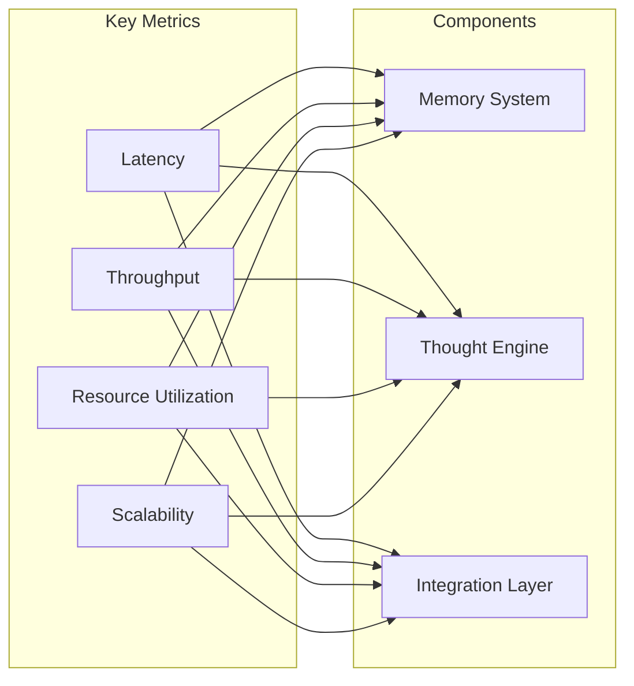
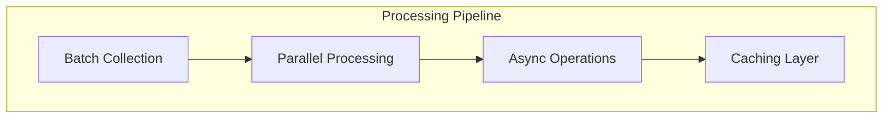
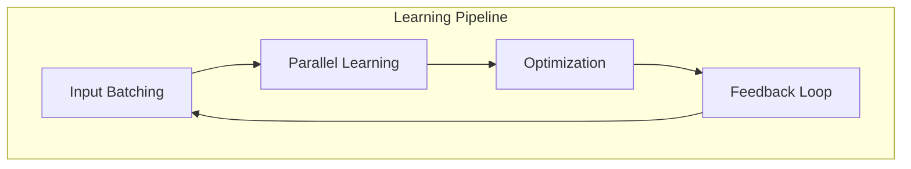
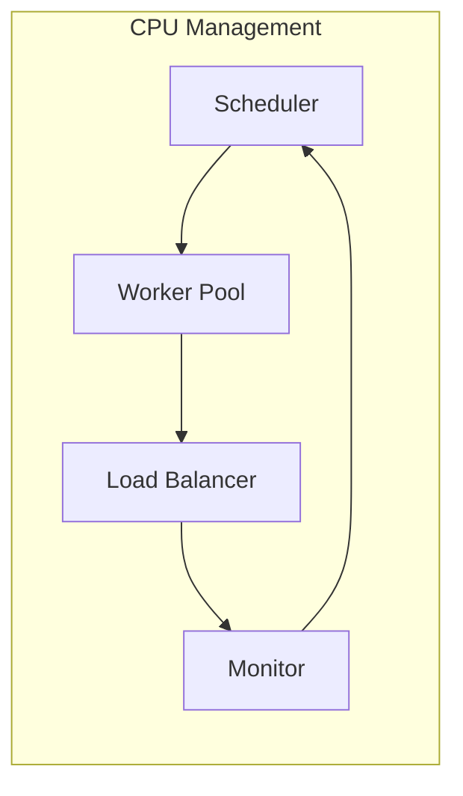
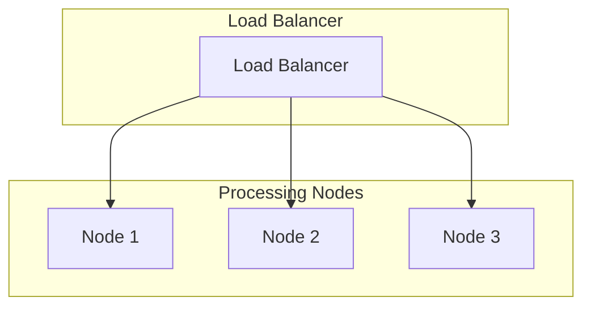
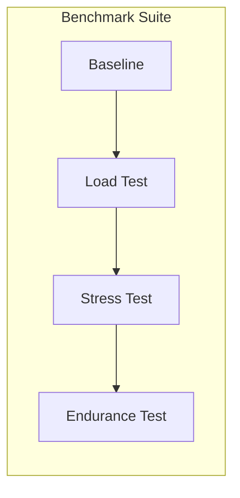
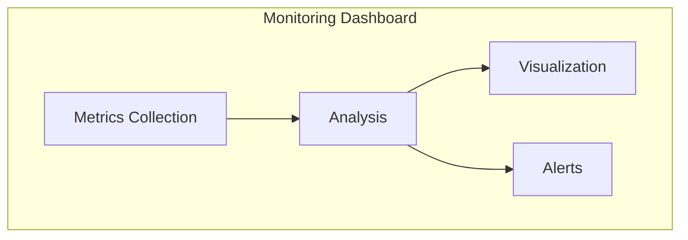

# Performance Considerations

## Overview

This document outlines the performance optimization strategies and considerations for the enhanced memory and thought engine system.

## Performance Metrics



## Memory System Optimizations

### 1. BadgerDB Performance Tuning

```go
type BadgerOptions struct {
    // Memory allocation
    MemoryLimit       int64
    NumMemtables     int
    
    // Compression
    CompressionLevel int
    
    // LSM tree configuration
    NumLevelZeroTables    int
    NumLevelZeroTablesStall int
    LevelSizeMultiplier   int
    
    // Cache configuration
    BlockCacheSize    int64
    IndexCacheSize    int64
}
```

#### Key Optimizations:
- LSM tree tuning for write-heavy workloads
- Bloom filter optimization for read operations
- Strategic compaction scheduling
- Memory-mapped file configuration
- Value log garbage collection tuning

### 2. Layer Processing Optimization



#### Strategies:
1. Batch Processing
   - Configurable batch sizes
   - Priority-based batching
   - Batch compression
   - Parallel batch processing

2. Caching
   - Multi-level cache
   - Predictive caching
   - Cache warming
   - Eviction strategies

## Thought Engine Optimizations

### 1. Pattern Detection Performance

```go
type PatternConfig struct {
    // Concurrent pattern detection
    ConcurrencyLevel int
    BatchSize       int
    
    // Pattern matching optimization
    MinPatternLength int
    MaxPatternLength int
    IndexingStrategy string
    
    // Resource management
    MemoryLimit     int64
    CPULimit       float64
}
```

### 2. Learning System Performance



## Resource Management

### 1. Memory Management

```go
type MemoryManager struct {
    // Pool configuration
    PoolSize        int64
    AllocationLimit int64
    
    // Garbage collection
    GCThreshold    float64
    GCInterval     time.Duration
    
    // Monitoring
    MemoryMetrics  *Metrics
}
```

### 2. CPU Utilization



## Performance Monitoring

### 1. Real-time Metrics

```go
type PerformanceMetrics struct {
    // Latency metrics
    ProcessingLatency    time.Duration
    StorageLatency      time.Duration
    NetworkLatency      time.Duration
    
    // Throughput metrics
    RequestsPerSecond    float64
    BytesProcessed      int64
    
    // Resource metrics
    MemoryUsage        float64
    CPUUsage          float64
    DiskIO            IOMetrics
}
```

### 2. Alerting Thresholds

```go
type PerformanceAlerts struct {
    // Latency thresholds
    MaxProcessingLatency time.Duration
    MaxStorageLatency   time.Duration
    
    // Resource thresholds
    MemoryThreshold    float64
    CPUThreshold      float64
    DiskIOThreshold   float64
}
```

## Scaling Strategies

### 1. Horizontal Scaling



### 2. Vertical Scaling

```go
type ResourceAllocation struct {
    // Memory allocation
    MinMemory    int64
    MaxMemory    int64
    
    // CPU allocation
    MinCPU      float64
    MaxCPU      float64
    
    // Storage allocation
    MinStorage  int64
    MaxStorage  int64
}
```

## Performance Testing

### 1. Load Testing Configuration

```go
type LoadTestConfig struct {
    // Test parameters
    ConcurrentUsers     int
    RequestsPerSecond   int
    TestDuration       time.Duration
    
    // Resource limits
    MaxMemoryUsage     int64
    MaxCPUUsage       float64
    
    // Success criteria
    MaxLatency        time.Duration
    MinThroughput     float64
}
```

### 2. Performance Benchmarks



## Optimization Guidelines

### 1. Memory Layer Optimization
- Use memory pools for frequent allocations
- Implement efficient garbage collection
- Optimize data structures for access patterns
- Use compression for large datasets

### 2. Processing Optimization
- Implement parallel processing where possible
- Use worker pools for CPU-intensive tasks
- Optimize algorithm complexity
- Implement efficient caching strategies

### 3. Storage Optimization
- Optimize database indexes
- Implement efficient compaction strategies
- Use appropriate compression levels
- Optimize I/O patterns

### 4. Network Optimization
- Implement connection pooling
- Use efficient serialization
- Optimize packet sizes
- Implement request batching

## Performance Monitoring Tools

### 1. Metrics Collection
```go
type MetricsCollector struct {
    // Collection configuration
    SampleInterval  time.Duration
    BufferSize     int
    
    // Metric types
    SystemMetrics  bool
    CustomMetrics  bool
    TraceMetrics   bool
}
```

### 2. Visualization



These performance considerations ensure optimal system operation while maintaining scalability and reliability. Regular monitoring and adjustment of these parameters is essential for maintaining peak performance.